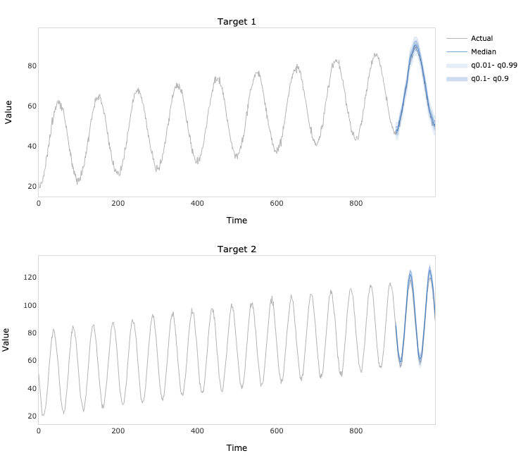
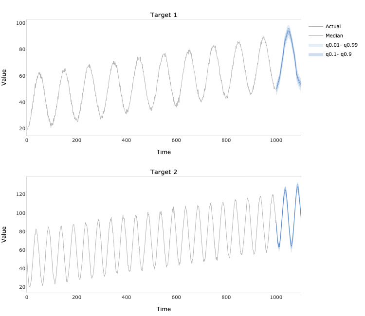

# DeepTCN TensorFlow


TensorFlow implementation of multivariate time series forecasting model introduced in Chen, Y., Kang, Y., Chen, Y., 
and Wang, Z. (2020). Probabilistic forecasting with temporal convolutional neural network. *Neurocomputing*, 399, 491-501.
[https://doi.org/10.1016/j.neucom.2020.03.011](https://doi.org/10.1016/j.neucom.2020.03.011).

## Dependencies
```bash
pandas==1.3.4
numpy==1.19.5
tensorflow==2.7.0
tensorflow_probability==0.14.1
plotly==5.3.1
kaleido==0.2.1
```
## Usage
```python
import numpy as np
from deep_tcn_tensorflow.model import DeepTCN

# Generate two time series
N = 1000
t = np.linspace(0, 1, N)
e = np.random.multivariate_normal(mean=[0, 0], cov=[[1, 0.25], [0.25, 1]], size=N)
a = 40 + 30 * t + 20 * np.cos(2 * np.pi * (10 * t - 0.5)) + e[:, 0]
b = 50 + 40 * t + 30 * np.sin(2 * np.pi * (20 * t - 0.5)) + e[:, 1]
y = np.hstack([a.reshape(- 1, 1), b.reshape(- 1, 1)])

# Fit the model
model = DeepTCN(
    y=y,
    x=None,
    forecast_period=100,
    lookback_period=200,
    quantiles=[0.01, 0.1, 0.5, 0.9, 0.99],
    filters=4,
    kernel_size=3,
    dilation_rates=[1, 2],
    loss='nonparametric'
)

model.fit(
    learning_rate=0.01,
    batch_size=64,
    epochs=200,
    verbose=1
)
```
```python
# Plot the in-sample predictions
predictions = model.predict(index=900)
fig = model.plot_predictions()
fig.write_image('predictions.png', width=750, height=650)
```

```python
# Plot the out-of-sample forecasts
forecasts = model.forecast()
fig = model.plot_forecasts()
fig.write_image('forecasts.png', width=750, height=650)
```

